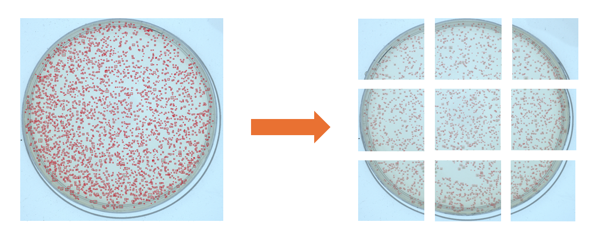
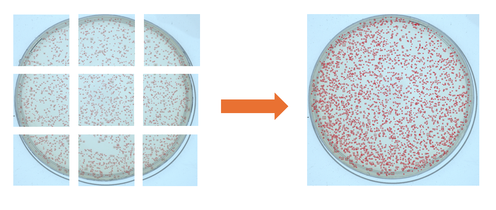

# Massive Annotation Splitter

### Introduction

We noticed that when there are a lot of labels corresponding to one picture, it is possible that the annotation platform 
will present lag working on the picture. We estimate that there are a lot of labels when the picture present more than 
1000 annotations. 
Therefore, when there are a lot of labels corresponding to one picture, it will be difficult to correct the picture in 
an annotation platform. This is why the **massive annotation splitter** program was developed. This tool enables to 
split of a picture in several tiles. The annotations are extracted and reframed to the tiles.
This split helps to easily (and without lag) perform annotation correction with your favorite annotation tool (could
 be *LabelMe* or *Supervise.ly*).

When the corrections are made, it is likely that the user will want to fetch previous whole picture and reframe the 
corrected annotations to the whole picture. The **massive annotation splitter** support this feature in the `unifiy.py`
program.

### Split program

This program could be used to split a picture in tiles and reframe the annotation from whole picture to tiles, as seen 
below:

 

This function can be executed using `cut.py` program like:    
```python src/cut.py -src example/dataset_labelme_unified -dst example/dataset_labelme_cut -cut 3 --margin 20 -prg 1```

The margin argument represent the portion (in pixels) of overlap between tiles.
The cut argument represents the square root of the number of tiles registered after the cutting.

### Unify program

This program could be used to unify the annotation tiles into a whole picture. The process is described below:

 

This function can be executed using `unify.py` program like:    
```python src/cut.py -src example/dataset_labelme_unified -dst example/dataset_labelme_cut -cut 3 --margin 20 -prg 1```


### Predictions and cut program

This program is used to perform predictions thanks to object detection AI model and then cut the picture into tiles. 
This program does not support argument parser because it is difficult to handle the customized detector as argument.
This program was designed only for our personal used but can be modified to be extended to other needs (especially 
changing the type of object detector).


### Tasks to improve the program

Some features could be added to improve the program:
- Enlarge the supported annotation types (for the moment only *Supervise.ly* and *LabelMe* are supported).
- Enlarge the supported annotation shapes (for the moment only rectangles are supported).